# Ficha técnica | O Mercado

## Índice  
[Caso](#caso)  
[Objetivos](#objetivos)  
[Suposições e Dúvidas](#suposições-e-dúvidas)  
[Métodos e Técnicas](#métodos-e-técnicas)  
[Ferramentas](#ferramentas)  
[Organização de planilhas no Google Sheets](#organização-de-planilhas-no-google-sheets)  
[Pré-processamento de dados](#pré-processamento-de-dados)  
[Resultados e Conclusões](#resultados-e-conclusões)  
[Limitações](#limitações)

## Caso
    
    A loja O Mercado está em um ambiente altamente compe
    titivo e está enfrentando mudanças significativas nas preferências dos consumidores. A fidelidade do cliente tornou-se um desafio, e a loja em questão busca manter e aumentar suas receitas através de uma melhor compreensão de sua base de clientes e personalização de suas estratégias de marketing e retenção.
    
## Objetivos
    
    🎯 Objetivo principal:
    
    → Entender o comportamento de compra dos clientes.
    
    🎯 Objetivos específicos:
    
    → Organizar o banco de dados;
    
    → Entender o perfil dos clientes;
    
    → Analisar as vendas;
    
    → Fazer uma segmentação dos clientes;
    
    → Realizar uma análise de coorte;
    
    → Desenvolver um dashboard.
    
## Suposições e Dúvidas

| 🧐 Suposições | 🤔 Dúvidas |
| --- | --- |
| Pessoas que residem com crianças compram mais doces | Qual é a relação entre o número de crianças e as vendas? |
| Pessoas idosas compram mais frutas | O tipo de produto vendido pode estar associado com a idade das pessoas? |
| O número de vendas em loja física é maior que o número de vendas virtuais | Que tipo de produto é mais vendido? |
| Pessoas mais jovens têm menor poder de compra | Que tipo de produto é menos vendido? |
| -- | Qual faixa etária é predominante na base de clientes? |
| -- | Qual é o nível de escolaridade e a faixa de renda que é predominante na base de clientes? |
| -- | Quantas transações foram feitas por ano? |
| -- | Pessoas casadas consomem mais? |
    
## Métodos e Técnicas
    
    → Análise exploratória dos dados.
    
    → Segmentação por comportamento de compra (através da metodologia RFM).
    
    → Análise de coorte.
    
## Ferramentas
    
    → Google Sheets para o banco de dados.
    
    → Notion para planejamento e anotações importantes.
    
    → Looker Studio para dashboard.
    
## Organização de planilhas no Google Sheets
    
Os dados foram organizados em 4 planilhas no Google Sheets: clientes, transacoes, resumo_compras, dados_completos.

### clientes
---

**Organização da planilha:**

→ A planilha clientes foi organizada 2 páginas: em clientes_original e clientes.

→ Na página clientes_original ficaram os dados originais, sem alterações. Essa página também contém uma tabela com o total de células vazias por coluna, uma tabela com o total de clientes por faixa etária, gráficos de dispersão com outliers de idade, uma tabela com células de "salario_anual_dolar” vazias, um gráfico de dispersão com outliers de salário.

→ Na página clientes ficaram os dados sobre os clientes livres de espaços vazios.

#### clientes_original
    
    → id_cliente: Identificador (id) do cliente.
    
    → id_cliente_unico: Variável criada para averiguar se o id foi repetido na coluna id_cliente.
    
    → ano_nascimento: Ano de nascimento do cliente.
    
    → nivel_educacao: Escolaridade dos clientes.
    
    → estado_civil: Estado civil dos clientes.
    
    → salario_anual_dolar: Salário anual em dólar de cada cliente.
    
    → criancas_ate_dez_anos: Número de crianças com até 10 anos de idade que residem com o cliente.
    
    → criancas_mais_dez_anos: Número de crianças com mais de 10 anos de idade que residem com o cliente.
    
    → data_entrada: Data de cadastro do cliente.
    
    → resposta_campanha: Clientes que responderam à campanha.
    
    → idade: Idade do cliente.
    
    → faixa_etaria: Faixa etária do cliente.
    
    → salario_anual_dolar_med: Salário anual em dólar de cada cliente, com células vazias e outliers substituídos pela mediana de salario_anual_dolar.

#### clientes
    
    → id_cliente: Identificador (id) do cliente.
    
    → ano_nascimento: Ano de nascimento do cliente.
    
    → idade: Idade do cliente.
    
    → idade_moda: Idades dos clientes, com idades maiores que 100 substituídas pelo valor de idade mais frequente (46 anos).
    
    → faixa_etaria: Faixa etária do cliente.
    
    → nivel_educacao: Escolaridade dos clientes.
    
    → estado_civil: Estado civil dos clientes.
    
    → criancas_ate_dez_anos: Número de crianças com até 10 anos de idade que residem com o cliente.
    
    → criancas_mais_dez_anos: Número de crianças com mais de 10 anos de idade que residem com o cliente.
    
    → salario_anual_dolar: Salário anual em dólar de cada cliente.
    
    → salario_anual_dolar_med: Salário anual em dólar de cada cliente, com células vazias e outliers substituídos pela mediana de salario_anual_dolar.
    
    → data_entrada: Data de cadastro do cliente.
    
    → resposta_campanha: Clientes que responderam à campanha.

### transacoes
---
**Organização da planilha:**

→ A planilha transacoes foi organizada 3 páginas: em transacoes_original, transacoes_ids_repetidos, e transacoes.

→ Na página transacoes_original ficaram os dados originais, sem alterações. Essa página também contém uma tabela com o total de células vazias por coluna.

→ Na página transacoes_ids_repetidos ficaram os dados sobre as transações livres de espaços vazios, uma tabela com informações extras sobre as transações que não possuíam registros de IDs de clientes.

→ Na página transacoes ficaram os dados sobre as transações ordenados por ID dos clientes e por data de transação.

#### transacoes_original
    
    → id_transacao: Identificador (id) de transação.
    
    → id_cliente: Identificador (id) do cliente.
    
    → data_transacao: Data em que foi realizada a transação.
    
    → lugar_transacao: Tipo de transação (presencial ou virtual).

#### transacoes_ids_repetidos
    
    → id_cliente: Identificador (id) do cliente.
    
    → id_cliente_unico: Variável criada para averiguar se o id foi repetido na coluna id_cliente.
    
    → id_transacao: Identificador (id) de transação.
    
    → id_transacao_unico: Variável criada para averiguar se o id foi repetido na coluna id_transacao.
    
    → data_transacao: Data em que foi realizada a transação.
    
    → lugar_transacao: Tipo de transação (presencial ou virtual).

#### transacoes
    
    → id_cliente: Identificador (id) do cliente.
    
    → id_transacao: Identificador (id) de transação.
    
    → data_transacao: Data em que foi realizada a transação.
    
    → lugar_transacao: Tipo de transação (presencial ou virtual).

### resumo_compras
---
**Organização da planilha:**

→ A planilha resumo_compras foi organizada 2 páginas: resumo_compras_ids_repetidos e resumo_compras.

→ Na planilha resumo_compras_ids_repetidos ficaram os dados originais, sem alterações. Além disso, essa planilha foi usada para verificar a existência de IDs de clientes repetidos, e para gerar gráficos de dispersão para identificar outliers nos produtos vendidos.

→ Na planilha ficaram os dados sobre as compras (livres de IDs repetidos).

#### resumo_compras_ids_repetidos
    
    → id_cliente: Identificador (id) do cliente.
    
    → id_cliente_unico: Variável criada para averiguar se o id foi repetido na coluna id_cliente.
    
    → total_vinho: Total de vinhos comprados.
    
    → total_frutas: Total de frutas compradas.
    
    → total_carnes: Total de carnes compradas.
    
    → total_peixes: Total de peixes comprados.
    
    → total_doces: Total de doces comprados.
    
    → total_outros: Total de outros produtos comprados.

#### resumo_compras
    
    → id_cliente: Identificador (id) do cliente.
    
    → total_vinho: Total de vinhos comprados.
    
    → total_frutas: Total de frutas compradas.
    
    → total_carnes_med: Total de carnes compradas, sendo os valores acima de 1500 substituídos pela mediana de total_carnes.
    
    → total_peixes: Total de peixes comprados.
    
    → total_doces: Total de doces comprados.
    
    → total_outros: Total de outros produtos comprados.
    
    → total_compras: Soma de todas compras.
    
    → total_carnes: Total de carnes compradas.

### dados_completos
---
**Organização da planilha:**

→ A planilha dados_completos foi organizada em 9 páginas: clientes, transacoes, resumo_compras, transacoes_e_compras, perfil_transacoes_compras, score_quintis, perfil_clientes, coorte, analise_por_transacao.

→ A página principal, que reúne a maior parte dos dados é a página perfil_transacoes_compras.

→  A página perfil_clientes reúne gráficos e tabelas resumo sobre o perfil dos clientes.

→ A página coorte contém as tabelas da análise de coorte.

→ A planilha dados_completos reúne dados das planilhas clientes, transacoes, resumo_compras. Por isso, aqui serão mencionadas apenas as variáveis que ainda não foram explicadas.

#### transacoes
    
    → mes_transacao_mais_recente: Mês da transação mais recente.
    
    → ano_transacao_mais_recente: Ano da transação mais recente.
    
    → valor_monetario: Compras / quantia gasta.

#### transacoes_e_compras
    
    → id_cliente_clientes: ID de clientes (coluna extraída da página clientes).
    
    → registro_de_transacao: Coluna para verificar se existia registro de transação para cada id de cliente.
    
    → registro_de_compra: Coluna para verificar se existia registro de compra para cada id de cliente.

#### perfil_transacoes_compras
    
    → faixa_salario_anual: Faixa de salário, com classificações geradas a partir da variável salario_anual_dolar_med.
    
    → reside_com_criancas: Variável criada para verificar se o cliente residia ou não com alguma criança.

#### score_quintis
    
    → data_entrada_mes_ano: Mês e ano da data de cadastro do cliente.
    
    → recencia_dias: Recência em dias.
    
    → recencia_score: Score/Pontuação da recência.
    
    → frequencia_score: Score/Pontuação da frequência.
    
    → valor_monetario_score: Score/Pontuação do valor monetário.
    
    → rfm_pontuacao: Média entre recência, frequência e valor monetário.
    
    → media_frequencia_monetario: Média entre a frequência e o valor monetário.

#### coorte
    
    → data_transacao_ano-mes: Ano e mês da transação.
    
    → data_entrada_ano-mes: Ano e mês da data de entrada/cadastro do cliente.
    
    → dif_entrada-transacao_meses: Diferença em meses entre a data de entrada/cadastro do cliente (data_entrada_ano-mes) e a data de transação (data_transacao_ano-mes).
            
## Pré-processamento de dados

### Identificar células vazias
---

**→ Primeiro passo:**

1º) A ferramenta de filtro foi utilizada para identificar se existiam espaços vazios.

2º) Nos casos em que existiam espaços vazios, a função CONTAR.VAZIO foi usada para contar os espaços vazios existentes em cada coluna.

**→ Detalhes sobre células vazias em cada planilha:**

- Planilha clientes
    - Espaços vazios:
        - Existiam 24 espaços vazios na coluna salario_anual_dolar.
            
            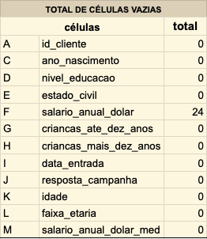
            
    - Procedimento:
        - Os dados dos 24 clientes que não possuíam registro sobre o salário não foram excluídos, por isso, os espaços vazios foram preenchidos com a mediana de todos os salários (sem considerar os espaços vazios).
        - A mediana foi escolhida para preencher os espaços vazios por não ser afetada por valores extremos (outliers), diferente da mediana que é sensível a valores extremos e pode ser "puxada” para mais próximo dos valores extremos. Como esses valores extremos não são representativos para o conjunto de dados, optei por usar a mediana.
        - Criei uma nova coluna que foi chamada de salario_anual_dolar_med. Usei a fórmula =ARRAYFORMULA(SE(OU(F3="",F3>600000),$Z$6,F3)), para indicar que se a célula de salário anual fosse vazia ou maior que 600000 (um outlier), deveria ser preenchida com o valor da mediana.

- Planilha transacoes
    - Espaços vazios
        - Existiam 7 espaços vazios na coluna id_cliente.
            
            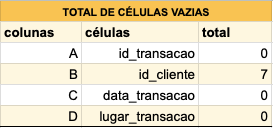
            
    - Procedimento
        - As transações que não tinham registro dos ids dos clientes não foram excluídas. Mas, não foram consideradas para análise principal.
        - Verificou-se que as células vazias tinham valor igual a zero, pensando nisso, foi usada a fórmula =SE(A22123=0, "NC", A22123) na célula A22123 da página transacoes_ids_repetidos. Dessa forma, se a célula referente ao id dos clientes estivesse vazia, seria preenchida com "NC” (que significa “Não Cadastrado”).
        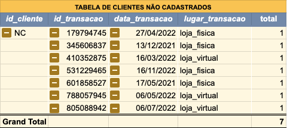

- Planilha resumo_compras
    - Espaços vazios
        - Não foram encontrados espaços vazios.
    - Procedimento
        - Não foi necessário.

### Identificar ids repetidos

**→ Primeiro passo:**

1º) Foi criada uma coluna para identificar valores repetidos. 

2º) Para essa coluna, foi usada a função CONT.SE, de modo que, caso o valor da célula em análise aparecesse mais de uma vez na mesma coluna, seria retornado o valor "repeated_id", caso contrário, seria retornado o valor "unique_id".

3º) Foi criada uma tabela para contar o número de "repeated_id" e para ver as linhas em que existiam células com o valor "repeated_id".

**→ Detalhes sobre ids repetidos em cada planilha:**

- Planilha clientes
    - Na página clientes_original, foi criada uma coluna chamada id_cliente_unico para verificar se existiam valores repetidos na coluna id_cliente.
    - Não foram encontrados valores repetidos na coluna id_cliente.
    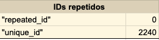

- Planilha transacoes
    - Na página transacoes_ids_repetidos, foi criada uma variável chamada id_cliente_unico e uma outra variável chamada id_transacao_unico. A função da coluna id_cliente_unico era retornar "repeated_id" caso existissem ids de clientes repetidos, e a função da coluna id_transacao_unico era retornar "repeated_id" caso existissem ids de transações repetidos.
    - Verificou-se que, existiam ids de clientes repetidos, porque um cliente pode fazer mais de uma transação, e que não existiam ids de transações repetidos.
        
        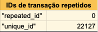
        
- Planilha resumo_compras
    - Na página resumo_compras_ids_repetidos foi criada uma coluna chamada id_cliente_unico para verificar se existiam ids de clientes repetidos.
    - Foram encontrados 9 ids de clientes repetidos.
        
        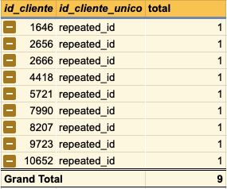
        
    - Verificou-se também que nas linhas que continham esses ids de clientes repetidos, os outros dados também se repetiam.
        
        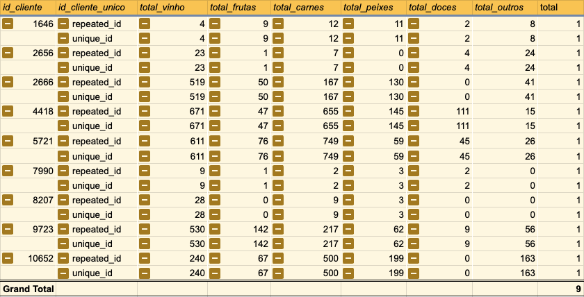
        
        📍 Por isso, as linhas em que existiam ids de clientes repetidos não foram consideradas para a análise principal.

### Outliers
→ Para visualizar os outliers foram usados gráficos de dispersão.

- Planilha clientes
    - Foram gerados gráficos de dispersão para as variáveis idade e salario_anual_dolar:
    - Gráfico de idade:
        
        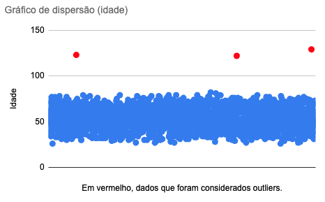
        
        → As idades acima de 100 anos foram consideradas outliers e não foram consideradas para a análise principal. 
        
        → Observação: É possível inferir que pessoas com mais de 100 anos, devido à idade avançada, não realizaram um cadastro; e, portanto, as idades acima de 100 anos podem ser resultado de algum erro no cadastro. 
        
    - Gráfico de salário anual:
        
        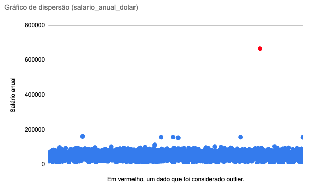
        
        → O salário acima de 600000 foi considerado outlier e não foi considerado para a análise principal.

- transacoes
    → Não foram encontrados outliers.

- resumo_compras
    → Foram considerados como outliers os dados acima de 1500 da coluna total_carnes.

    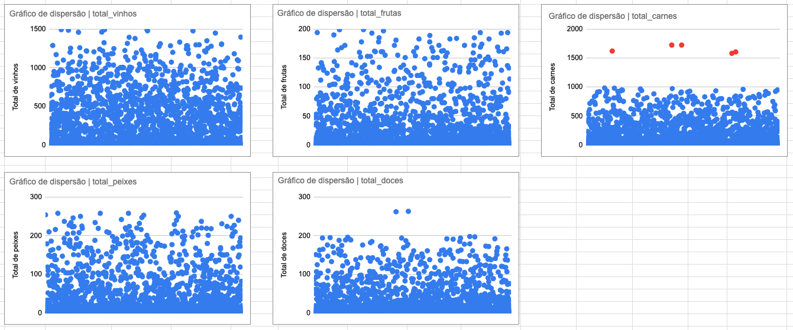

    → Os outliers foram substituídos pela mediana, porque a mediana é um valor que não é afetado por valores extremos.

### Unir tabelas

→ Para a análise principal dos dados, foram considerados apenas os dados dos clientes que realizaram alguma transação e que tinham registros de compra, esses dados foram registrados na planilha dados_completos.

→ Pensando nisso, foi criada uma tabela na página transacoes_e_compras. Nessa tabela, usou-se a função query para obter os ids dos clientes da página clientes (presente na planilha dados_completos). Foram criadas também duas colunas, uma chamada registro_de_transacao e outra chamada registro_de_compra; estabeleceu-se uma lógica em que, se o id do cliente estivesse presente na página transacoes (presente na planilha dados_completos), o valor retornado na coluna registro_de_transacao seria "positivo”, caso contrário, o valor retornado seria “negativo”; no caso da coluna registro_de_compra, a mesma lógica foi utilizada, mas fazendo a verificação na página resumo_compras (presente na planilha dados_completos).

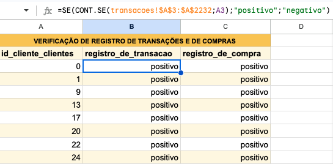

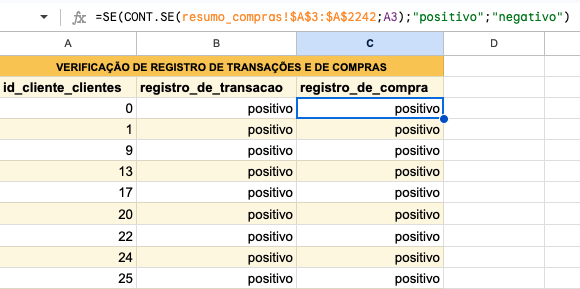

→ Dessa forma, usando a função query, foi possível obter apenas os ids dos clientes em que o resultado foi positivo para registro_de_transacao e para registro_de_compra.

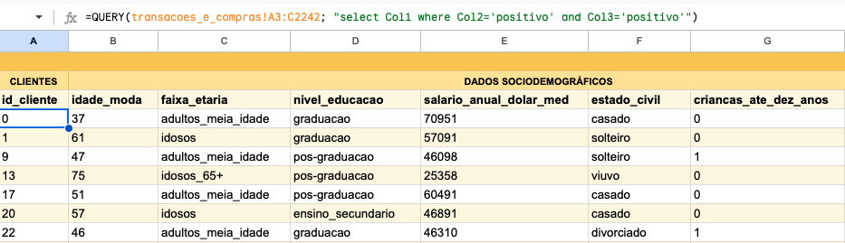

## Resultados e Conclusões

### 1. Dados sociodemográficos

---

### 1.1 Faixa Etária

**Foram definidas as seguintes faixas etárias:**

- adultos jovens: idade menor ou igual a 34 anos.

- adultos de meia idade: idade entre 35 e 54 anos.

- idosos: idade entre 55 e 64 anos.

- idosos (+65): mais de 65 anos de idade.

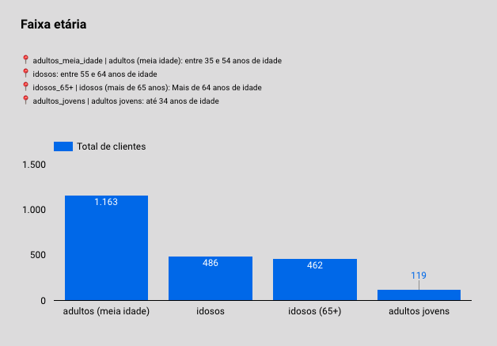

Observou-se que de um total 2230 clientes, 1163 se enquadravam na faixa de adultos de meia idade, 486 na faixa de idosos, 462 na faixa de idosos (+65), e 119 na faixa de adultos jovens. Somando o total de idosos e de idosos (65+), temos o valor 948. Uma hipótese para explicar o alto número de pessoas idosas é que esse valor pode estar relacionado com a região em que se encontra o estabelecimento, algumas regiões têm um maior número de habitantes idosos. 

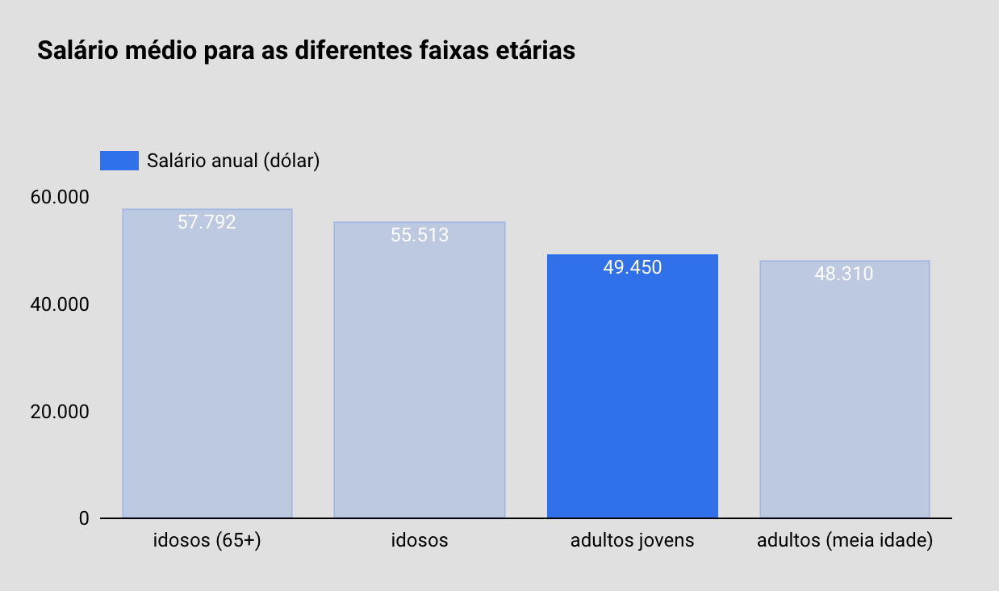

Uma outra hipótese seria que adultos jovens teriam menos poder aquisitivo, mas ao analisar o gráfico de salário médio para as diferentes faixas etárias, é possível notar que o salário médio dos adultos jovens era semelhante ao salário médio dos adultos de meia idade, que são o maior grupo.

<aside>
💡 Seria interessante pensar em estratégias para atrair e fidelizar clientes jovens, assim como pensar em estratégias para manter o público mais velho.

</aside>

<aside>
💡 Por que o nosso grupo de clientes que são adultos jovens tem salário anual que, em média, é semelhante ao de adultos de meia idade? A loja está sendo atrativa para os adultos jovens com salários baixos?

</aside>

### 1.2 Escolaridade

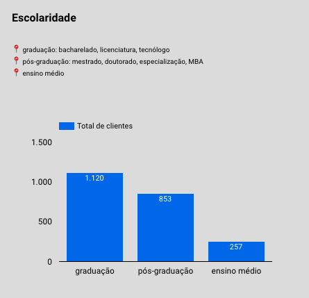

→ Apenas 257 clientes não têm ensino superior.

### 1.3 Faixa de salário

**Foram definidas as seguintes faixas de salário:**

- Baixo salário:
    
    Menor ou igual a $40000.
    

- Médio salário:
    
    Entre $40001 e $80000.
    

- Alto salário:
    
    Maior que $80000.
    

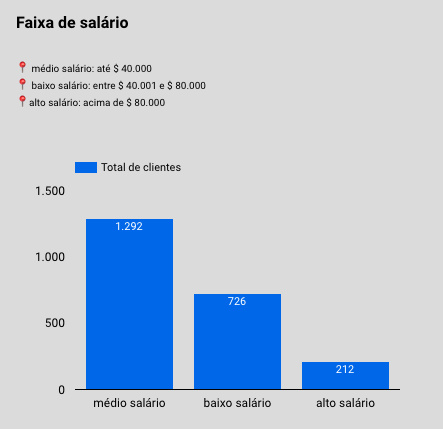

De um total 2230 clientes, 1292 clientes recebiam um salário médio, 726 clientes recebiam um salário baixo (baixo_salario), e 212 clientes recebiam um salário alto (alto_salario).

<aside>
💡 O conhecimento sobre a distribuição de renda dos clientes pode influenciar o planejamento de produtos. O supermercado pode decidir quais produtos oferecer com base nas preferências e capacidade de compra dos diferentes grupos de renda.

</aside>

<aside>
💡 Compreender a distribuição de renda dos clientes pode orientar as estratégias de precificação. Por exemplo, produtos premium podem ser direcionados aos clientes de alta renda, enquanto ofertas e promoções especiais podem ser mais eficazes para atrair clientes de renda mais baixa.

</aside>

### 1.4 Estado Civil

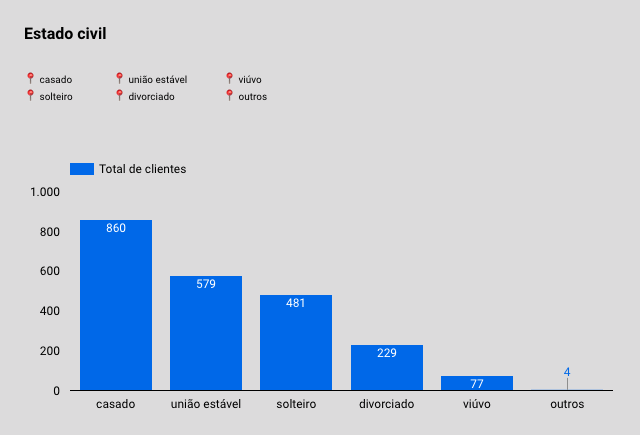

Do total de clientes, 1439 (64,53%) dos clientes são casados ou convivem com uma pessoa em união estável, enquanto 787 (35,29%) dos clientes são solteiros, divorciados, ou viúvos, e apenas 4 clientes responderam "outros” para o seu estado civil.

### 1.5 Crianças

Do total de clientes, 1598 (71,66%) reside com, pelo menos, 1 criança. Sendo que, 944 (42,33%) clientes residem com, pelo menos, 1 criança com até 10 anos de idade, e 1080 (48,43%) clientes residem com, pelo menos, 1 criança com mais de 10 anos de idade.

<aside>
💡 O maior número de clientes com crianças pode indicar uma demanda por produtos específicos, como alimentos para bebês, fraldas, lanches escolares, brinquedos, entre outros itens voltados para famílias com crianças.

</aside>

<aside>
💡 O supermercado pode adaptar suas estratégias de marketing para atender melhor às necessidades das famílias com crianças, como oferecer descontos em produtos infantis e outros produtos populares entre famílias com crianças.

</aside>

<aside>
💡 O supermercado pode considerar a implementação de serviços adicionais, como carrinhos de compras especiais para famílias e até mesmo a realização de eventos voltados para esse público.

</aside>

### 2. Tipo de transação (presencial ou virtual)

---

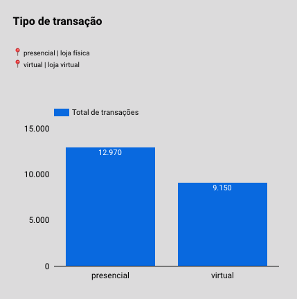

Todas as faixas etárias apresentaram preferência por compras em lojas físicas, embora exista uma parcela significativa de compras pela loja virtual.

### 3. Resposta à campanha

---

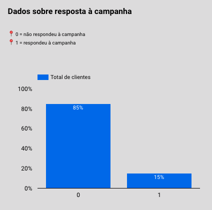

85% das pessoas não responderam à campanha.

Perguntas importantes para compreender o que pode ter influenciado os clientes a não responderem à campanha:

→ Qual era o objetivo da campanha?

→ Qual foi o canal de comunicação utilizado para fazer a campanha?

→ Qual foi a linguagem utilizada na campanha?

→ Houve incentivo para a participação dos clientes?

→ Qual o tempo necessário para responder a campanha?

### 4. Segmentação por comportamento de compra

---

### **4.1 Para fazer a segmentação foram utilizadas as seguintes categorias como parâmetro:**

1. Campeões: Comprou recentemente. Compra com frequência. E gasta muito!
2. Clientes recentes: Comprou recentemente. Mas não com frequência.
3. Clientes fiéis: Gasta um bom dinheiro. Com frequência.
4. Clientes que precisam de atenção: Boa pontuação para a recência, frequência e valores monetários. (Pode não ter comprado muito recentemente).
5. Em risco: Gastou muito dinheiro e comprou com freqüência. Mas há muito tempo. (Precisa trazê-los de volta)!
6. Hibernando: A última compra foi feita a algum tempo. Pouco gasto e baixo número de pedidos.
7. Lealdade potencial: Clientes recentes. Gastaram uma boa quantia. Compraram mais de uma vez.
8. Não posso perdê-los: Fez grandes compras e com frequência. Mas há algum tempo.
9. Perdido: Recência, frequência e pontuação monetária mais baixas.
10. Prestes a "hibernar": Pontuação baixa para a recência, frequência e valores monetários. (Os perderá se não for reativado).
11. Promissor: Compradores recentes. Mas não gastaram muito.

### **4.2 Tabela usada como referência para fazer a segmentação:**

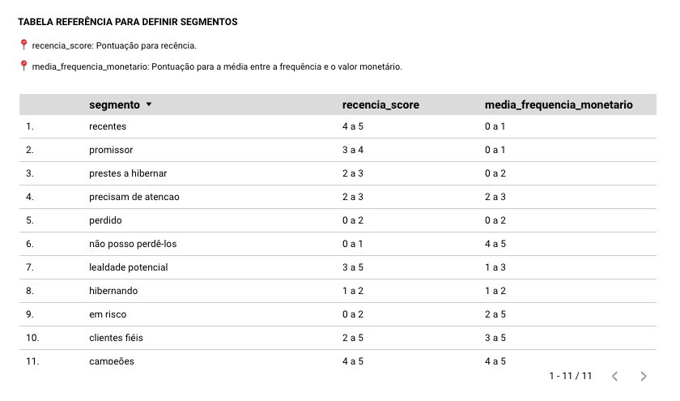

> No conjunto de dados, foram encontradas 7 categorias das 11 descritas.
> 

### 4.3 Distribuição dos segmentos por total de clientes

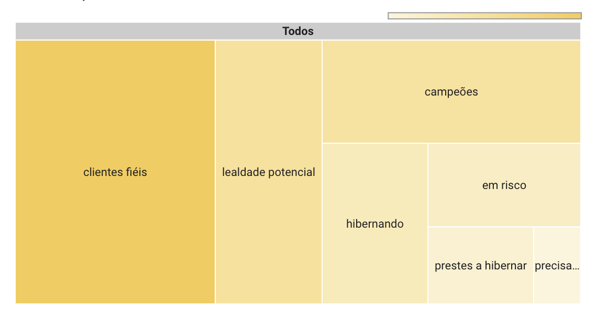

### **4.4 Segmentos que investiram maior valor monetário em compras e que realizaram mais transações:**

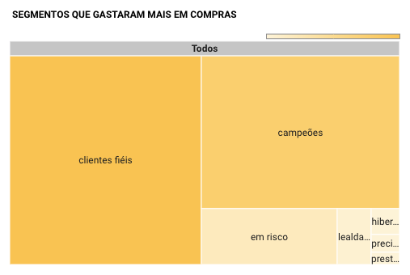

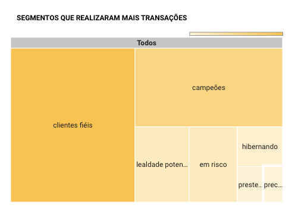

**Destaque para os seguintes segmentos:**

---

- Clientes fiéis:
    - Gasta um bom dinheiro. Com frequência.
    - Recência: 2 a 5.
    - Média entre frequência e valor monetário: 3 a 5.
    

- Campeões:
    - Comprou recentemente. Compra com frequência. E gasta muito!
    - Recência: 4 a 5.
    - Média entre frequência e valor monetário: 4 a 5.
    

- Em risco:
    - Gastou muito dinheiro e comprou com freqüência. Mas há muito tempo. (Precisa trazê-los de volta)!
    - Recência: 0 a 2.
    - Média entre frequência e valor monetário: 2 a 5.

- Lealdade potencial:
    - Clientes recentes. Gastaram uma boa quantia. Compraram mais de uma vez.
    - Recência: 3 a 5.
    - Média entre frequência e valor monetário: 1 a 3.

<aside>
 É importante notar que os segmentos em_risco e lealdade_potencial merecem maior atenção. Pois, o 1º já gastou muito e comprou com frequência, e pode voltar a fazer isso. Enquanto o 2º segmento comprou recentemente e até mais de uma vez, essa oportunidade pode ser aproveitada para estimular esse segmento a comprar mais e com maior frequência.

</aside>

### **4.5 Distribuição de faixa de salário por segmento:**

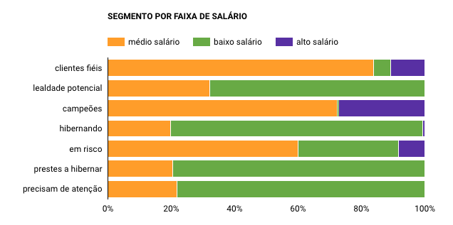

→ É interessante notar que uma parcela considerável dos clientes com altos salários se concentra nos segmentos de clientes fiéis e campeões, é importante investir em manter a fidelização desse grupo e trazer de volta os clientes com altos salários que se encontram no segmento "em risco”, já que o segmento "em risco” representa os clientes que compram muito e com frequência, mas pontuaram baixo para a recência.

→ Ainda olhando para os segmentos clientes fiéis e campeões, é possível notar que esses segmentos contém os menores percentuais de clientes com baixos salários. É importante notar também que o grupo de clientes com baixos salários representa **32,6%** da amostra, um percentual significativo, e não pode ser subestimado. Esses clientes representam mais de 75% do total de clientes que se encontram nos segmentos "hibernando”, "prestes a hibernar”, e “precisam de atenção”. Por isso, é importante investir em iniciativas que atendam aos interesses e necessidades desse público.

### 5. Produtos

---

### **5.1 Produtos mais vendidos**

Em média, os produtos com maior faturamento foram o vinho e a carne. Esses produtos apresentam maior faturamento nos diferentes segmentos de clientes e nas diferentes faixas etárias.

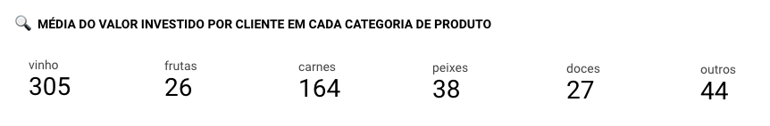

### **5.2 Consumo dos clientes que residem ou não com crianças**

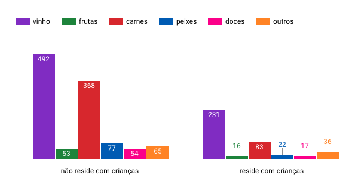

Foi possível notar que os clientes que residem com crianças (embora representem 71,66% dos clientes) compram menos.

Alguns fatores que podem ter influenciado esses resultados são o tempo e os recursos disponíveis. É possível inferir que pessoas que são responsáveis por crianças têm menos tempo para ir ao mercado e menos recursos financeiros.

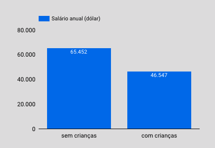

Ao analisar o salário anual desses dois grupos, vemos que as pessoas que residem com crianças têm um salário anual menor. Contudo, esse dado não é suficiente para afirmar que essa é a causa desse grupo de pessoas comprar menos.

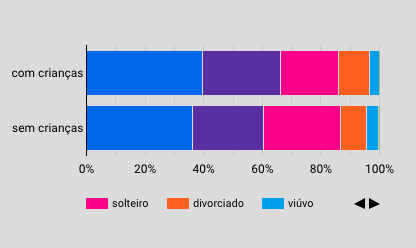

Também foi possível notar que 33.73% dos clientes que residem com crianças são solteiros, ou divorciados, ou viúvos. Talvez essas pessoas sejam as únicas pessoas adultas que têm alguma renda em suas residências, o que tornaria a rotina mais corrida e afetaria o orçamento, ou talvez sejam mães solo. Essas são apenas hipóteses.

### 5.3 Percentual de transações ao longo dos meses

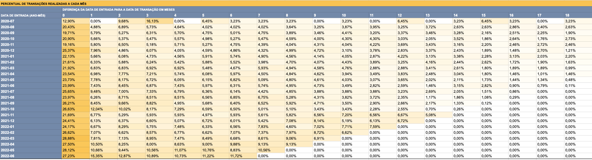

→ A partir da análise de coorte foi possível perceber que a maior concentração de transações ocorre no 1º mês de cadastro, o que já era esperado, mas cai consideravelmente poucos meses após o cadastro. Contudo, notou-se uma melhora nessa concentração de transações ao longo dos últimos meses. 

<aside>
💡 É preciso continuar investindo no engajamento dos clientes.

</aside>

## Limitações
→ Não saber a região em que o supermercado está localizado.

→ Não saber o que representa a categoria "outros” no estado civil dos clientes.

→ Não o canal de comunicação utilizado para fazer a campanha.

→ Não saber o gênero e nem a renda familiar desses clientes.

### 👩🏽‍💻 **Para acessar a pasta com as planilhas desse projeto, [clique aqui](https://drive.google.com/drive/folders/1-49-pEVpP7HW_zn_h0wJ19XA3B_sZb21?usp=sharing).**

### 👩🏽‍💻 **Para acessar o dashboard desse projeto, [clique aqui](https://lookerstudio.google.com/reporting/860c3b1a-2669-4431-aee4-cda406584c1d).**

  

<b>Obrigada por sua atenção!